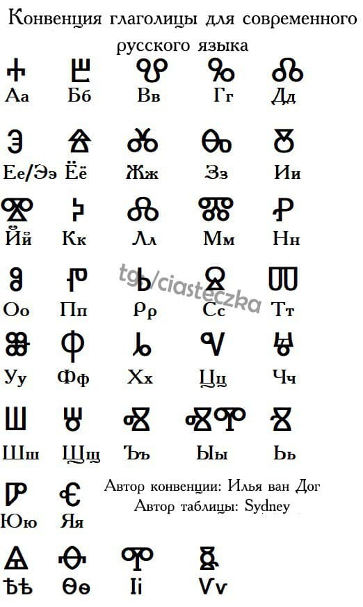

Конвенция для русского языка разработана Ilya Van Dogh.

Исторически кириллица практически полностью соответствовала глаголице, однако современный русский алфавит отличается от кириллицы тысячелетней давности. Например, в нём не было отдельной буквы "э", которая в конвенции обозначается тем же самым символом, что и "е" (Ⰵ). Современная глаголица - это больше способ эквивалентной записи современной кириллицы, а не фонетической передачи современной речи звуками подлинной древней глаголицы.
