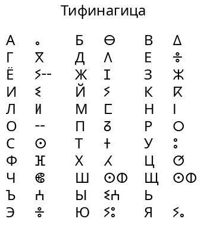

Тифинагица - это письменность для настоящих пацанов.

Тифинаг - письменность современных туарегов (африканский народ группы берберов), восходящая к древнеливийскому письму. Тифинагица разработана как письменность для современного русского языка, использующая в некоторых случаях близкие к русским звуки, а в некоторых - фиктивные символы или сочетания (например, "ш" и "щ" кодируются последовательностью ⵙⵀ, буквально "сх", от принятого в английском языке буквосочетания "sh").

Следует отметить, что в тифинаге нет заглавных и строчных букв.

Глубокого смысла в тифинагице нет, она создана чисто для фана.
